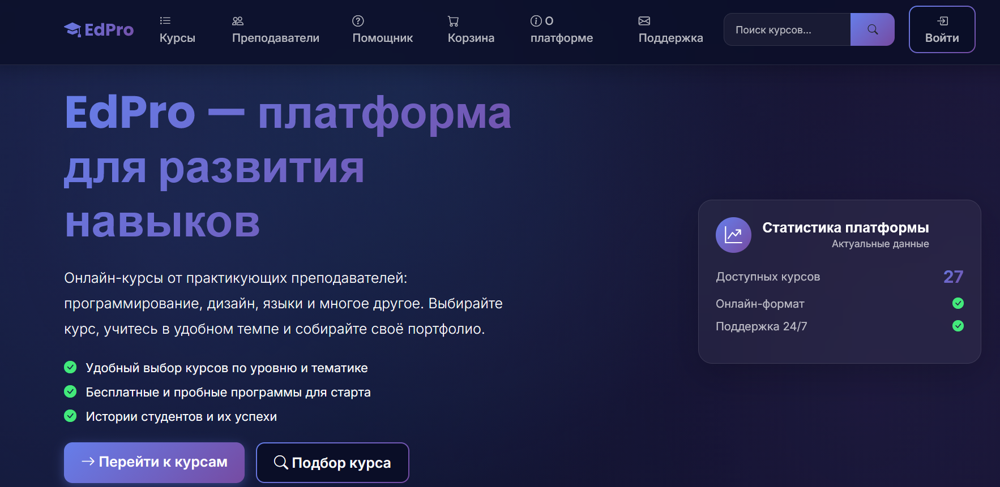
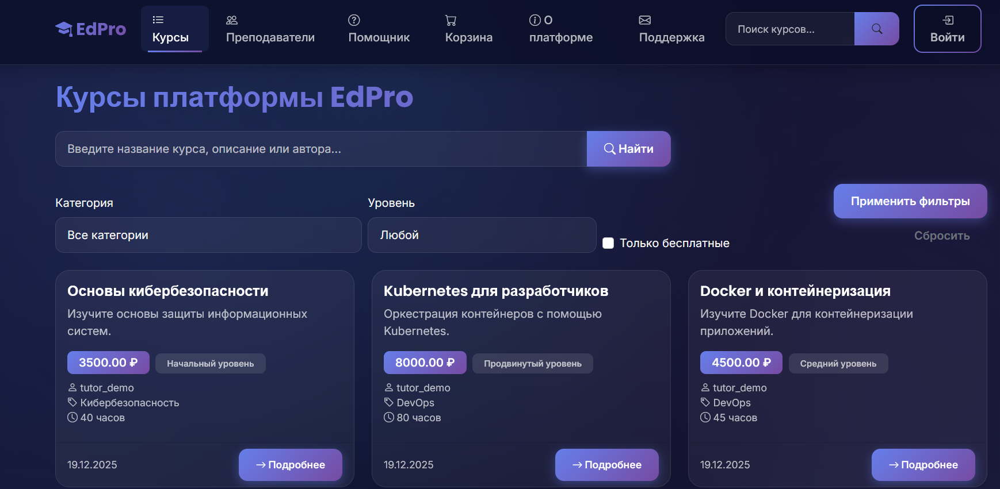
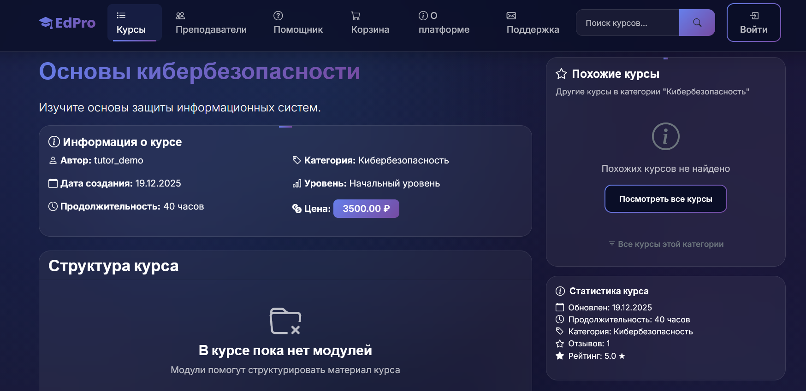
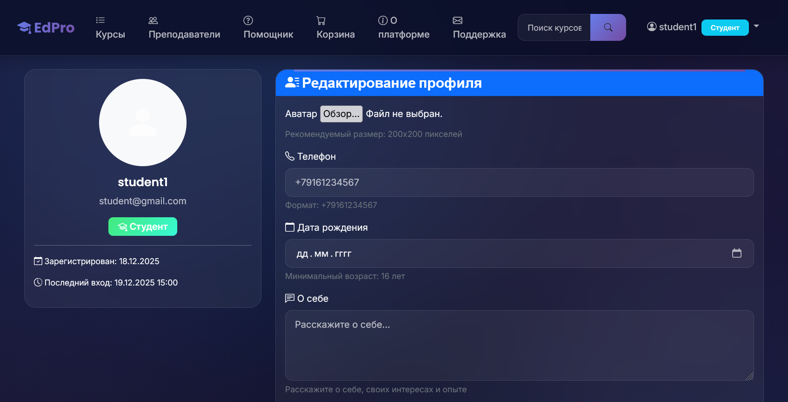
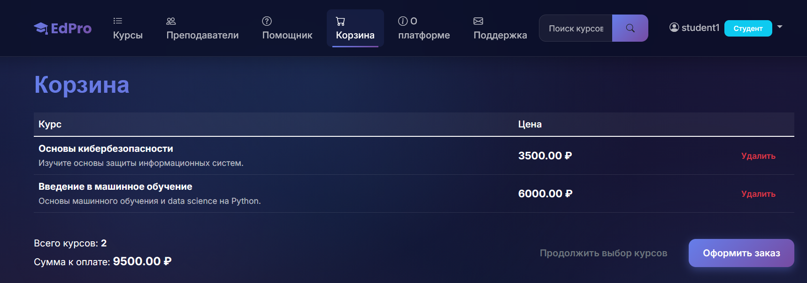
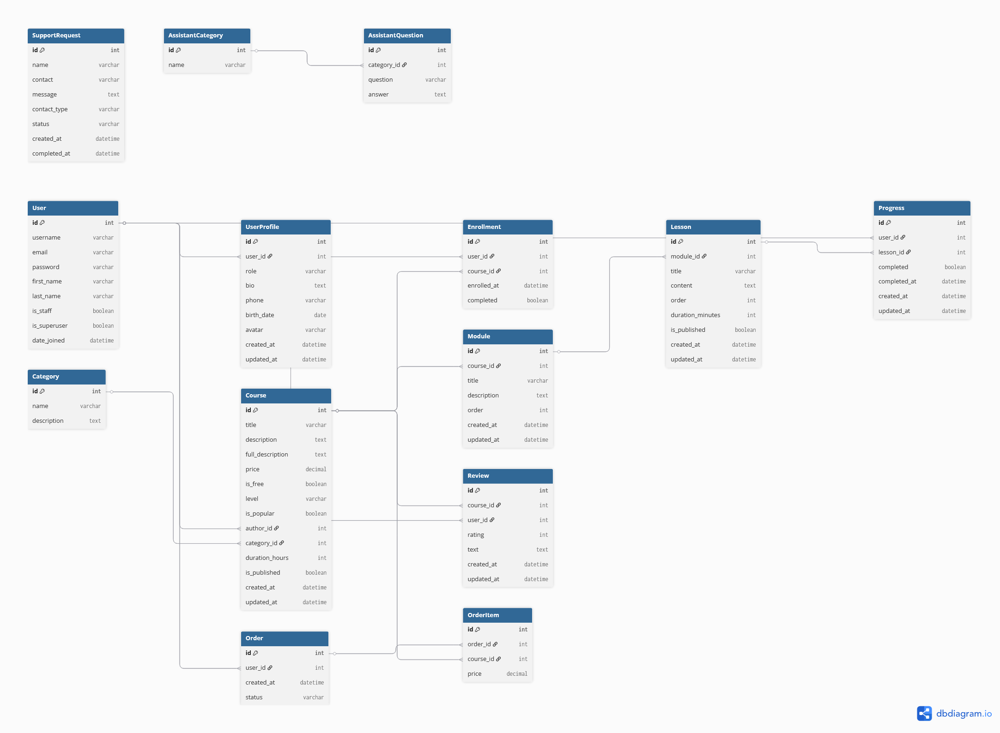
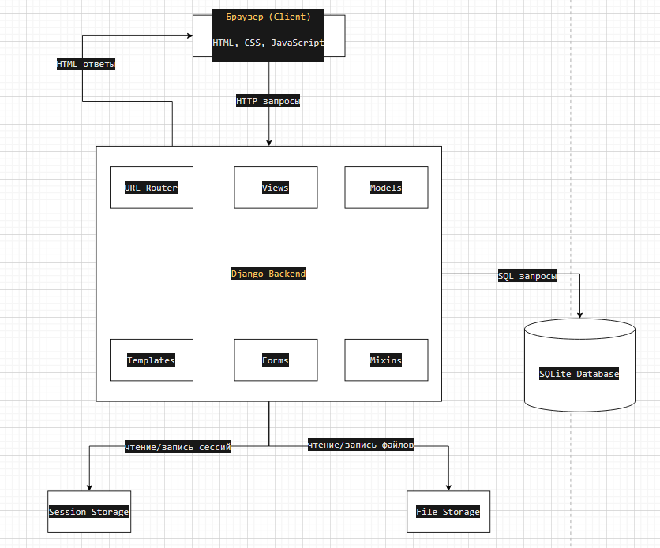

# EdPro Platform — Платформа онлайн-обучения

EdPro Platform — это веб-приложение для создания, продажи и прохождения онлайн-курсов. Платформа позволяет преподавателям создавать структурированные курсы с модулями и уроками, а студентам — записываться на курсы, отслеживать прогресс обучения и оставлять отзывы.

Проект разработан на Django 6.0 и использует классическую архитектуру MVT (Model-View-Template). Платформа поддерживает систему ролей (студенты, преподаватели, администраторы), корзину покупок, систему заказов, отслеживание прогресса обучения и онлайн-помощника с FAQ.

## Features

- **Каталог курсов** с фильтрацией по категориям, уровню сложности и цене
- **Система ролей**: студенты, преподаватели и администраторы с разными правами доступа
- **Структурированное обучение**: курсы → модули → уроки с отслеживанием прогресса
- **Корзина и заказы**: полноценная система покупки платных курсов
- **Система отзывов и рейтингов**: пользователи могут оставлять отзывы с оценкой от 1 до 5 звезд
- **Онлайн-помощник**: FAQ по категориям и форма обратной связи
- **Тест подбора курсов**: рекомендации на основе предпочтений пользователя
- **Аналитика для администраторов**: статистика по курсам, заказам и выручке
- **Управление контентом**: преподаватели могут создавать и редактировать курсы, модули и уроки
- **Профили пользователей**: расширенные профили с аватарами, биографией и контактной информацией
- **Отслеживание прогресса**: автоматический расчет прогресса по урокам, модулям и курсам

## Tech Stack

### Backend
- **Python 3.8+** — язык программирования
- **Django 6.0** — веб-фреймворк
- **SQLite** — база данных (для разработки)

### Frontend
- **HTML5/CSS3** — разметка и стили
- **Bootstrap** — CSS-фреймворк для UI
- **JavaScript** — интерактивность на клиенте

### Библиотеки и инструменты
- **Pillow** — обработка изображений (аватары)
- **Django Templates** — система шаблонов
- **Django Admin** — административная панель

### Архитектура
- **MVT (Model-View-Template)** — архитектурный паттерн Django
- **Class-Based Views** — представления на основе классов
- **Mixins** — переиспользуемые компоненты для контроля доступа

## Installation

### Предварительные требования
- Python 3.8 или выше
- pip (менеджер пакетов Python)
- Git (для клонирования репозитория)

### Пошаговая инструкция

#### 1. Клонирование репозитория

```bash
git clone <URL-вашего-репозитория>
cd edpro-platform-main
```

#### 2. Создание виртуального окружения

**Windows:**
```bash
python -m venv venv
venv\Scripts\activate
```

**macOS/Linux:**
```bash
python3 -m venv venv
source venv/bin/activate
```

#### 3. Установка зависимостей

```bash
pip install -r requirements.txt
```

#### 4. Переход в директорию проекта

```bash
cd studyhub
```

#### 5. Применение миграций базы данных

```bash
python manage.py makemigrations
python manage.py migrate
```

#### 6. Создание суперпользователя

```bash
python manage.py createsuperuser
```

Следуйте инструкциям для ввода имени пользователя, email и пароля.

#### 7. (Опционально) Загрузка тестовых данных

Если в проекте есть management-команды для создания тестовых данных:

```bash
python manage.py create_sample_data
```

#### 8. Запуск сервера разработки

```bash
python manage.py runserver
```

#### 9. Открытие в браузере

Откройте браузер и перейдите по адресу: `http://127.0.0.1:8000/`

#### 10. Доступ к админ-панели

Перейдите по адресу: `http://127.0.0.1:8000/admin/` и войдите с учетными данными суперпользователя.

## Screenshots

### Главная страница

*Главная страница с популярными и бесплатными курсами*

### Каталог курсов

*Страница каталога с фильтрацией по категориям и уровню*

### Детальная страница курса

*Подробная информация о курсе с отзывами и возможностью записи*

### Личный кабинет студента

*Страница "Мои курсы" с прогрессом обучения*

### Корзина и оформление заказа

*Корзина с выбранными курсами и оформление заказа*

> **Примечание**: Добавьте реальные скриншоты в папку `docs/screenshots/` и обновите пути к изображениям.

## ER-диаграмма базы данных



### Описание основных сущностей:

- **User** (Django встроенная модель) — пользователи системы
- **UserProfile** — расширенный профиль пользователя (роль, биография, аватар, телефон, дата рождения)
- **Category** — категории курсов
- **Course** — курсы (связь с автором, категорией, цена, уровень, продолжительность)
- **Module** — модули курса (связь с курсом, порядковый номер)
- **Lesson** — уроки модуля (связь с модулем, содержание, продолжительность)
- **Enrollment** — запись пользователя на курс
- **Progress** — прогресс прохождения уроков
- **Review** — отзывы о курсах (связь с курсом и пользователем, рейтинг)
- **Order** — заказы на покупку курсов
- **OrderItem** — позиции заказа (конкретные курсы в заказе)
- **AssistantCategory** — категории вопросов для FAQ
- **AssistantQuestion** — вопросы и ответы в FAQ
- **SupportRequest** — обращения пользователей в поддержку

### Связи между сущностями:

- **User** ↔ **UserProfile**: один к одному
- **User** ↔ **Course**: один ко многим (автор курса)
- **Category** ↔ **Course**: один ко многим
- **Course** ↔ **Module**: один ко многим
- **Module** ↔ **Lesson**: один ко многим
- **User** ↔ **Enrollment** ↔ **Course**: многие ко многим
- **User** ↔ **Progress** ↔ **Lesson**: многие ко многим
- **User** ↔ **Review** ↔ **Course**: многие ко многим
- **User** ↔ **Order**: один ко многим
- **Order** ↔ **OrderItem** ↔ **Course**: один ко многим
- **AssistantCategory** ↔ **AssistantQuestion**: один ко многим

> **Примечание**: Создайте ER-диаграмму на [dbdiagram.io](https://dbdiagram.io) или [draw.io](https://draw.io) и сохраните в `docs/er_diagram.png`

## API Endpoints

Проект использует классическую архитектуру Django с HTML-шаблонами, а не REST API. Ниже представлены основные URL-маршруты приложения:

### Основные страницы
- `GET /` — главная страница
- `GET /about/` — страница "О нас"

### Курсы
- `GET /courses/` — список всех курсов (с фильтрацией)
- `GET /courses/<id>/` — детальная страница курса
- `GET /courses/create/` — создание нового курса (требует авторизации, роль: преподаватель/администратор)
- `GET|POST /courses/<id>/edit/` — редактирование курса (требует авторизации, автор или администратор)
- `GET|POST /courses/<id>/delete/` — удаление курса (требует авторизации, автор или администратор)

### Модули и уроки
- `GET /courses/<course_id>/modules/` — список модулей курса
- `GET|POST /courses/<course_id>/modules/create/` — создание модуля (требует авторизации, автор курса)
- `GET /courses/<course_id>/modules/<module_id>/` — детальная страница модуля
- `GET|POST /courses/<course_id>/modules/<module_id>/edit/` — редактирование модуля
- `GET|POST /courses/<course_id>/modules/<module_id>/delete/` — удаление модуля
- `GET|POST /courses/<course_id>/modules/<module_id>/lessons/create/` — создание урока
- `GET /courses/<course_id>/modules/<module_id>/lessons/<lesson_id>/` — детальная страница урока
- `GET|POST /courses/<course_id>/modules/<module_id>/lessons/<lesson_id>/edit/` — редактирование урока

### Аутентификация
- `GET|POST /accounts/register/` — регистрация нового пользователя
- `GET|POST /accounts/login/` — вход в систему
- `GET /accounts/logout/` — выход из системы

### Профиль
- `GET|POST /profile/edit/` — редактирование профиля (требует авторизации)
- `GET /my-courses/` — мои курсы (требует авторизации)
- `GET /tutors/` — список преподавателей

### Отзывы и запись на курсы
- `GET|POST /courses/<id>/add-review/` — добавление отзыва (требует авторизации)
- `GET|POST /enroll/` — запись на курс через форму
- `POST /course/<id>/enroll/` — быстрая запись на курс

### Корзина и заказы
- `GET /cart/` — страница корзины (требует авторизации)
- `POST /cart/add/<id>/` — добавление курса в корзину (требует авторизации)
- `POST /cart/remove/<id>/` — удаление курса из корзины (требует авторизации)
- `GET|POST /checkout/` — оформление заказа (требует авторизации)
- `GET /orders/` — история заказов (требует авторизации)

### Онлайн-помощник
- `GET /assistant/faq/` — FAQ по категориям
- `GET|POST /assistant/contact/` — форма обратной связи
- `GET|POST /assistant/test/` — тест подбора курсов

### Администрирование
- `GET /admin-stats/` — аналитика (требует авторизации, роль: администратор)
- `GET /support-requests/` — список обращений в поддержку (требует авторизации, роль: администратор)
- `POST /support-requests/<id>/update-status/` — обновление статуса обращения

### Прогресс обучения
- `POST /progress/mark-lesson-completed/` — отметка урока как пройденного (требует авторизации)

## Архитектурная схема



### Описание компонентов:

1. **Браузер (Client)** — пользовательский интерфейс
   - Отображает HTML-страницы
   - Отправляет HTTP-запросы
   - Обрабатывает формы и AJAX-запросы

2. **Django Backend (Application Server)**
   - **URL Router** — маршрутизация запросов
   - **Views** — обработка бизнес-логики
   - **Models** — работа с данными
   - **Templates** — генерация HTML
   - **Forms** — валидация данных
   - **Mixins** — контроль доступа

3. **База данных (SQLite)**
   - Хранение всех данных приложения
   - Модели: User, Course, Module, Lesson, Order, Review и др.

4. **File Storage (Media Files)**
   - Хранение загруженных файлов (аватары, изображения)

5. **Session Storage**
   - Хранение данных корзины в сессии пользователя

### Поток данных:

1. Пользователь отправляет запрос через браузер
2. Django URL Router определяет соответствующий View
3. View обрабатывает запрос, взаимодействует с Models
4. Models выполняют запросы к базе данных
5. View получает данные и передает их в Template
6. Template генерирует HTML-ответ
7. Ответ отправляется обратно в браузер

> **Примечание**: Создайте архитектурную схему на [draw.io](https://draw.io) и сохраните в `docs/architecture.png`

## Структура проекта

```
edpro-platform-main/
├── studyhub/                    # Основной проект Django
│   ├── courses/                 # Приложение курсов
│   │   ├── models.py            # Модели данных (Course, Module, Lesson, Review и др.)
│   │   ├── views.py             # Представления (Class-Based Views)
│   │   ├── urls.py              # URL-маршруты приложения
│   │   ├── forms.py             # Формы для валидации данных
│   │   ├── admin.py             # Настройки админ-панели
│   │   ├── mixins.py            # Миксины для контроля доступа
│   │   ├── signals.py           # Django signals (если есть)
│   │   ├── management/          # Management-команды
│   │   │   └── commands/
│   │   │       ├── create_admin.py
│   │   │       └── create_sample_data.py
│   │   ├── migrations/          # Миграции базы данных
│   │   └── templates/           # HTML-шаблоны
│   │       └── courses/
│   ├── studyhub/                # Настройки проекта
│   │   ├── settings.py           # Конфигурация Django
│   │   ├── urls.py              # Главные URL-маршруты
│   │   ├── wsgi.py              # WSGI-конфигурация
│   │   └── asgi.py              # ASGI-конфигурация
│   ├── media/                   # Загруженные файлы (аватары)
│   ├── db.sqlite3               # База данных SQLite
│   └── manage.py                # Утилита управления Django
├── venv/                        # Виртуальное окружение Python
├── requirements.txt             # Зависимости проекта
├── README.md                    # Документация (этот файл)
└── docs/                        # Дополнительная документация
    ├── er_diagram.png           # ER-диаграмма БД
    ├── architecture.png          # Архитектурная схема
    └── screenshots/             # Скриншоты приложения
```

## Дополнительная информация

### Роли пользователей

- **Студент (student)**: может просматривать курсы, записываться на курсы, оставлять отзывы, отслеживать прогресс
- **Преподаватель (tutor)**: все возможности студента + создание и редактирование курсов, модулей и уроков
- **Администратор (admin)**: полный доступ ко всем функциям, включая управление обращениями в поддержку и аналитику

### Система прогресса

Пользователи могут отмечать уроки как пройденные. Система автоматически рассчитывает прогресс:
- По уроку (пройден/не пройден)
- По модулю (процент пройденных уроков)
- По курсу (процент пройденных уроков во всех модулях)

### Корзина и заказы

- Бесплатные курсы нельзя добавлять в корзину (доступна прямая запись)
- Платные курсы добавляются в корзину и оформляются через систему заказов
- После оформления заказа создается запись Enrollment для каждого курса

## Разработка

### Создание миграций

После изменения моделей в `models.py`:

```bash
python manage.py makemigrations
python manage.py migrate
```

### Запуск тестов

```bash
python manage.py test
```

### Создание суперпользователя

```bash
python manage.py createsuperuser
```

## Лицензия

Учебный проект, созданный в рамках учебной практики.

## Автор

Проект разработан для изучения Django и веб-разработки.

---

**Дата создания документации**: Декабрь 2024
